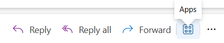
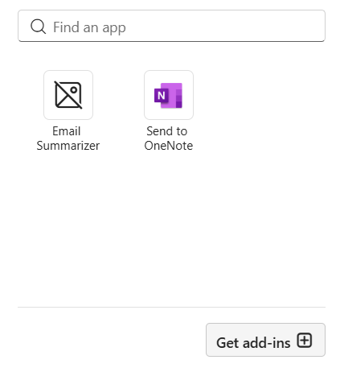
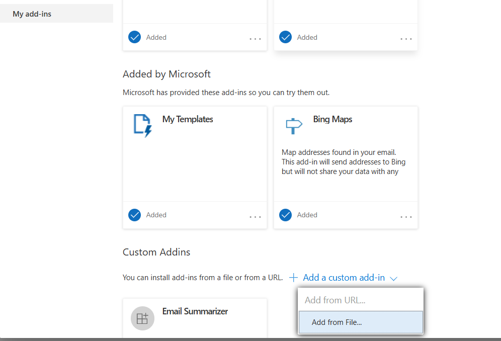

# Outlook Plugin

A plugin for Microsoft Outlook with a backend summarization service.

## 🚀 Getting Started

Follow the instructions below to run both the backend and frontend locally.

---

## 📦 Backend Setup

Navigate to the backend-summarizer directory from the root of the project:

```bash
cd backend-summarizer
npm install
node index.js
```

## 💻 Frontend Setup

Navigate to the outlook-plugin frontend directory from the root:

```bash
cd outlook-plugin
npm install
npm start
```

## 🔧 Installation Instructions

1. Click on the **Apps** button in Outlook:  
   

2. Then click **Get Add-ins**:  
   

3. Click **My Add-ins** → **Add a custom add-in** → **Add from file** → From there, choose the `manifest.xml` file from the `outlook-plugin` folder:  
   
